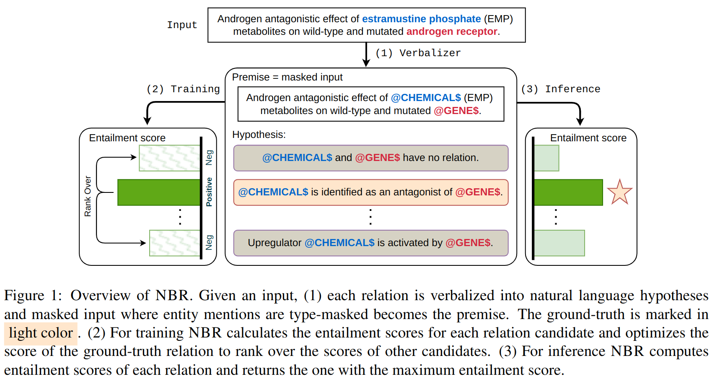
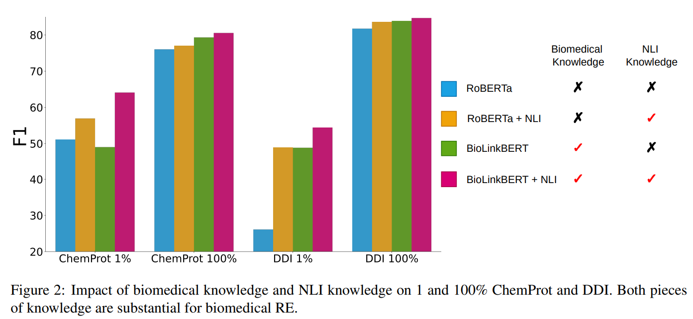

# NLI_as_Indirect_Supervision
Official Implementation for ["Can NLI Provide Proper Indirect Supervision for Low-resource Biomedical Relation Extraction?"](https://arxiv.org/pdf/2212.10784.pdf) ACL 2023

## Install
This repo is developed using python 3.9.12 with pytorch
Once pytorch is installed, you can install other dependencies via `pip install -r requirements.txt`.

## Data
We evaluate our method on three commonly used medical relation extraction benchmark: ChemProt, DDI and GAD.
We gather data from [LinkBERT](https://github.com/michiyasunaga/LinkBERT), and store in `data/chemprot_hf`, `data/DDI_hf` and `data/GAD_hf` respectively. We further subsample low resource 1shot, 50shot, 1% and 10% in `data/` as well, e.g.
`data/chemprot_hf_1shot`.

## Our method
We leverage indirect supervision to solve low-resource medical relation extraction: we formulate relation extraction as a natural langauge inference (NLI) task, so that we can cross-task transfer learning signal from NLI to relation extraction.

During training we verbalize each of the relation as hypothesis, and regard the input sentence as the premise. The model is trained under the objective that
the positive relation has the highest entailment score.
During inference we can simply rank the entailment score for each of the possible relation.
<p align="center">
  
</p>

We use [hydra+torch lightning](https://github.com/ashleve/lightning-hydra-template) to run our method.
For example:

- ChemProt
    ```
    python run.py profile=re_twostage model.model.model_path="cnut1648/biolinkbert-large-mnli-snli" \
      model.model.margin=0.7 model.model.temperature=0.01 \
      datamodule.batch_size=6 trainer.accumulate_grad_batches=16 \
      model.model.hypo_version=v2 model.model.use_loss="NCE+AC"
    ```

- DDI
    ```
    python run.py profile=re_twostage model.model.model_path="roberta-large-mnli" \
      model.model.margin=0.7 model.model.temperature=0.01 \
      datamodule.batch_size=3 trainer.accumulate_grad_batches=16 \
      datamodule=DDI model.num_negs=4 model.model.hypo_version=v1
    ```

Note that for relation verbalization, `src/datamodules/chemprot.py` and `src/datamodules/DDI.py` have `hypo_template` function
to control which verbalization method to use. We have found empirically the best performing ones are `v2` for ChemProt and `v1` for DDI. These represent "Descriptive" template in the paper.

## Results
We showed that our method is particularly effective for low-resource setting
<p align="center">
  
</p>

Moreover we identify secret sauce of success indirect supervision, namely having both biomedical knowledge (i.e. model should have pretrained on biomedical corpus) and NLI knowledge (i.e. model should be finetuned on NLI tasks).
<p align="center">
  
</p>

We refer details in the [paper](https://arxiv.org/pdf/2212.10784.pdf).

## Reference
If you find this repo useful, please cite our paper:
```
@inproceedings{xu2023can,
  title={Can NLI Provide Proper Indirect Supervision for Low-resource Biomedical Relation Extraction?},
  author={Xu, Jiashu and Ma, Mingyu Derek and Chen, Muhao},
  booktitle={Proceedings of the 61st Annual Meeting of the Association for Computational Linguistics (ACL)},
  year={2023}
}
```
